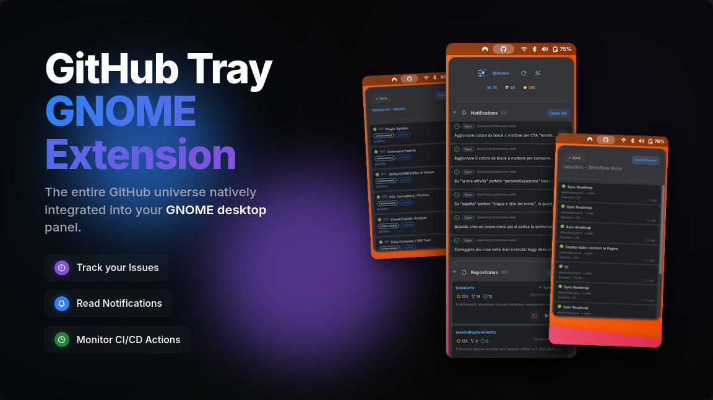

[](https://discord.gg/YrZPHAwMSG)

# GitHub Tray Gnome Extension

A GNOME Shell extension that puts your GitHub repos right in your top bar. Check stars, issues, and recent activity without opening a browser.



**Discord** - [Join our discord server](https://discord.gg/YrZPHAwMSG) and chat with the maintainers.

## What it does

- Shows your repos in a dropdown menu with GitHub-style UI
- Each repo displays stars, forks, issues, language, and last update time
- Click a repo to open it on GitHub, or open it locally if you've set a path
- Links to Issues and Fork parent directly from the menu
- Shows your avatar and total stars in the header
- Get notifications when repos gain stars, issues, or forks
- Auto-refresh every 5 minutes
- Sort by stars, name, last updated, or last pushed
- Map repos to local folders and open them in your editor with one click
- Right-click for more options

## Requirements

- GNOME Shell 48+
- libsoup3 (you probably already have it)
  
## Installation

```bash
git clone https://github.com/debba/github-tray-gnome-extension.git
cd github-tray-gnome-extension
make install
```

Then reload GNOME Shell:

- **X11**: Alt+F2, type `r`, Enter
- **Wayland**: log out and back in

Enable it:

```bash
gnome-extensions enable github-tray@extension
```

## Setup

Click the GitHub icon → Settings and add:

- Your GitHub username
- A personal access token

### Getting a token

Go to [github.com/settings/tokens](https://github.com/settings/tokens) and create a new token (classic).

Give it these scopes:

- `repo` (if you want private repos)
- `public_repo` (if you only care about public repos)

Copy the token and paste it in Settings.

### Local projects

Want to open repos directly in your editor?

1. Set your editor command in Settings (default: `code`)
2. Right-click any repo → "Set local path"
3. Pick the folder where you cloned it
4. Now clicking that repo opens it in your editor instead of the browser

Or manage all mappings in Settings → Repository Path Mappings.

## Package it

```bash
make pack
```

Creates `github-tray@extension.zip` for distribution.

## Troubleshooting

**Nothing shows up?**

```bash
# Check it's enabled
gnome-extensions list --enabled

# Watch the logs
journalctl -f -o cat /usr/bin/gnome-shell
```

**Error loading repos?**

- Double-check your username and token
- Token might be expired (they expire after a while)

**Can't set local paths?**

- Install zenity: `sudo pacman -S zenity`

## Development

For a complete development guide, see [dev/DEVELOPMENT.md](dev/DEVELOPMENT.md).

Quick commands:

```bash
./dev/install-dev.sh       # Install in development mode
./dev/test-nested.sh       # Test in nested GNOME Shell (Wayland-friendly)
./dev/reload-extension.sh  # Quick reload after changes
./dev/dev-logs.sh          # Watch logs filtered for this extension
```

Or use the Makefile:

```bash
make install
# Reload shell (Alt+F2 → r on X11, or logout on Wayland)
```

---

## In italiano

Estensione per GNOME Shell che mette i tuoi repo GitHub nella barra in alto. Controlli stelle, issue e attività recente senza aprire il browser.

**Installazione**: `make install` e riavvia GNOME Shell.

**Configurazione**: clicca l'icona → Impostazioni (Settings) e inserisci username e token.

Il token lo crei su [GitHub Settings](https://github.com/settings/tokens) con scope `repo` o `public_repo`.

**Progetti locali**: puoi mappare i repo a cartelle locali e aprirli nell'editor con un click. Vai nelle impostazioni per configurare tutto.

## License

MIT License - see [LICENSE](LICENSE) file for details
